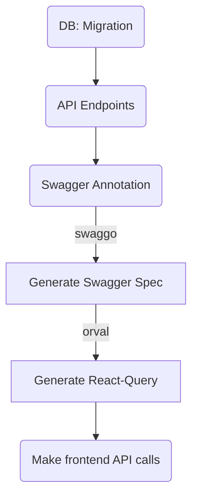

# Todo List: Postgres DB, (Restful) Go Api with swagger, React all Dockerized

## About

**Disclaimer: This is literally the first piece of software I have ever written in Go.**

This is an example of a restful api created using [Gin][Gin Gonic] with swagger
annotations added with [Swaggo][Swaggo]. The spec generated from these annotations
is fed to [Orval][Orval] to generate [React Query][React Query] code for making
api calls.

Since the main purpose of this project was to learn how to build APIs in Go, all the
frontend does is display a list of the todo items from the database.



## Running

1. `docker-compose up` to start the db, Api, and frontend
2. From the root of the project: `cd backend && go run db/migrations/20220825_204215.go && cd -` to Run the migration to create the todo table
3. View and interact with the API via swagger: http://localhost:8080/swagger/index.html#/
4. View the todo list at: http://localhost:3000/

## Scripts

Run query gen from the frontend to generate api-calls for React-Query via Orval.

```
pnpm run query-gen
```

## URLs

* Swagger: http://localhost:8080/swagger/index.html#/
* Frontend: http://localhost:3000/

[Gin Gonic]: https://github.com/gin-gonic/gin
[Swaggo]: https://github.com/swaggo/swag
[Orval]: https://orval.dev/
[React Query]: https://tanstack.com/query/v4/?from=reactQueryV3&original=https://react-query-v3.tanstack.com/
